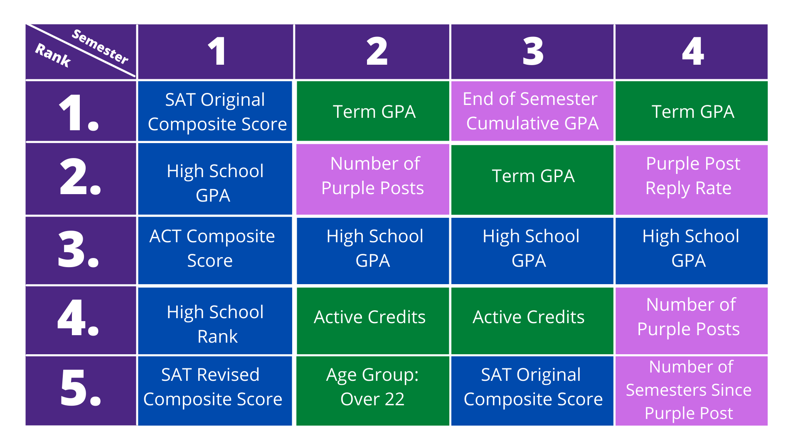
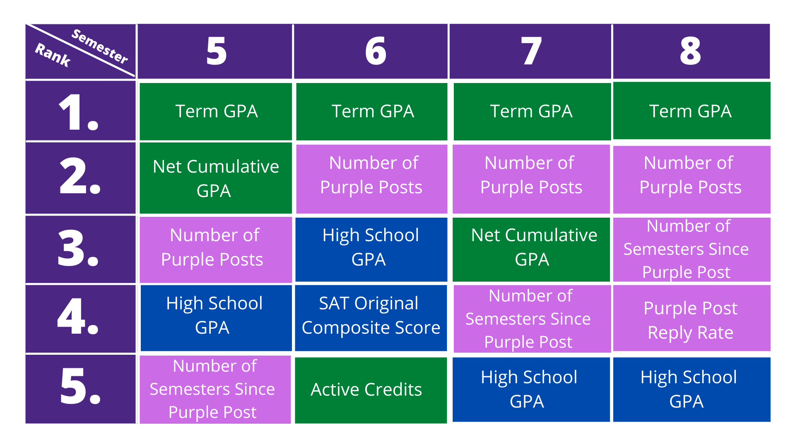

```{r setup, echo = FALSE}
knitr::opts_chunk$set(fig.retina = 3, warning = FALSE, message = FALSE)
```

```{r xaringan-themer, include=FALSE, warning=FALSE}
library(xaringanthemer)
style_mono_accent(base_color = "#4C2683")
```

```{r, echo = FALSE}
library(tidyverse)
library(gt)
```

## Creating a Withdrawl Risk Prediction Model

- Project Goal: Create a statistical model that uses student high school information, student term information, and Purple Post data to gives a prediction of whether a student will withdraw or graduate.

--

- Class Goal: Work through a data analysis project from beginning to end with creating a report consistent with reproducible research, develop an ability to speak and write clearly using the appropriate technical language of statistics, and develop critical thinking and problem-solving skills

---
## The Process
```{r out.width='70%', echo = FALSE, fig.align='center'}

```

---
## The Data

- Static Data

```{r, echo = FALSE}
static <- read_csv("Data_Raw/StudentStaticInformation.csv")
static <- head(static[,1:9], 4)
gt(static)
```

- Term Data

```{r, echo = FALSE}
term <- read_csv("Data_Raw/StudentTermInformation.csv")
term <- head(term[,1:8], 4)
gt(term)
```

---
## The Data

- Purple Post Master

```{r, echo = FALSE}
master <- read_csv("Data_Raw/PurplePostMaster.csv")
master <- head(master[,1:8], 3)
gt(master)
```

- Purple Post Concerns

```{r, echo = FALSE}
concerns <- read_csv("Data_Raw/PurplePostMaster.csv")
concerns <- head(concerns[,1:8], 3)
gt(concerns)
```

---
## The Data

- Purple Post Participants

```{r, echo = FALSE}
participants <- read_csv("Data_Raw/PurplePostParticipants.csv")
participants <- head(participants, 3)
gt(participants)
```

- Purple Post Replies

```{r, echo = FALSE}
replies <- read_csv("Data_Raw/PurplePostReplies.csv")
replies <- head(replies, 3)
gt(replies)
```

---
## Challenging the Problem in a New Way
- Missing values

--

- Avoiding future leak

--

- Cautions with using High School GPA as a predictor

--

- Quantifying changes in academics 

--

- Understanding the response variable (Drop-out and Transfers)


---
## EDA of Variables


---
## Variables Used for Modeling: Static Data
- High School GPA
- High School Rank
- High School Size
- ACT Composite Score
- SAT Revised Composite Score
- SAT Original Composite Score
- Legacy Student (Y/N)
- Committee Admit Decision (Y/N)

---
## Variables Used for Modeling: Term Data
- Active Credits
- End of Semester Cumulative GPA
- Term GPA
- Net Cumulative GPA Change
- Age
- Academic Focus
- Number of Majors
- Number of Major Changes
- Number of Department Changes

---
## Variables Used for Modeling: Purple Post Data
- Reply Rate
- Number of Posts 
- Number of Semesters Since Last Purple Post

---
## Defining the Scope of the Model

- The model is to be used to predict the results of currently enrolled undergraduate students. 

--

- The model uses variables created from previous semester data, thus we must have data for each semester completed of a student's college career thus far. 

--

- The model should not be used to predict outcomes for transfer students, graduate students, Harlaxton students, and special status students.

---
## Modeling Overview

- Separate risk models for semesters 1-8 using the previous semester's data
- Tested multiple model types using training and validation sets

```{r out.width='60%', echo = FALSE, fig.align='center'}
knitr::include_graphics("Presentation_Files/dataflowchart.jpeg") 
```

---
## Model Results


```{r, echo = FALSE}
AUC_values <- c(.62, .761, .778, .785, .786, .843, .883, .913)
Semester <- c(1:8)
Model_Type <- c("XGBoost", "XGBoost", "XGBoost", "XGBoost", "Random Forest", "XGBoost", "Random Forest", "Random Forest" )
results <- data.frame(Semester, AUC_values, Model_Type)
results <- results %>%
  rename(
    `AUC Value` = AUC_values,
    `Model Type` = Model_Type
  )
gt(results)
```


---
## Our Model Predicts Slightly Under the True Line

```{r out.width='50%', echo = FALSE, fig.align='center'}
 
```

---
## Variable Importance of Early Semester Models

```{r out.width='70%', echo = FALSE, fig.align='center'}
 
```

---
## Variable Importance of Late Semester Models

```{r out.width='70%', echo = FALSE, fig.align='center'}
 
```

---
## Use of Models for Predictive Purposes

- Load Shiny App

- Import Specified Data

- Run the App

- View and Filter Resulting Predictions

- Note: Resulting predictions are on a scale from 0 to 1.0 with 0 representing no chance of withdrawing and 1 representing a 100% chance of withdrawing according to our model. 
---
## Conclusions

- We are able to create a model that accurately predicts a student's chance of withdrawing.


- Purple Post data is important in generating predictions on a student's chance of withdrawing. 

--

## Thank you for your time! 

## Feedback and questions are allowed at this time.
